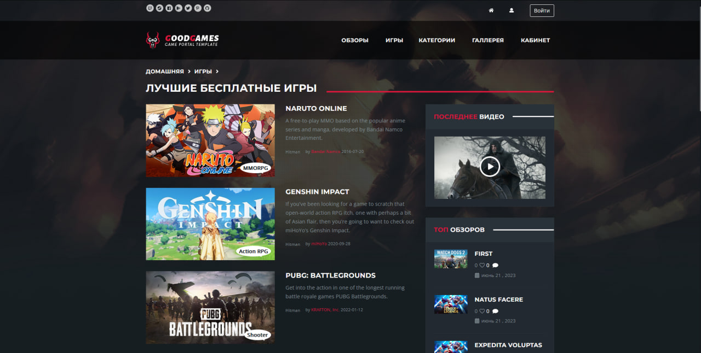
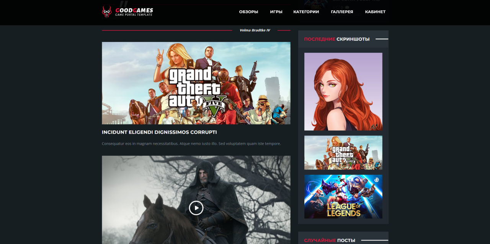
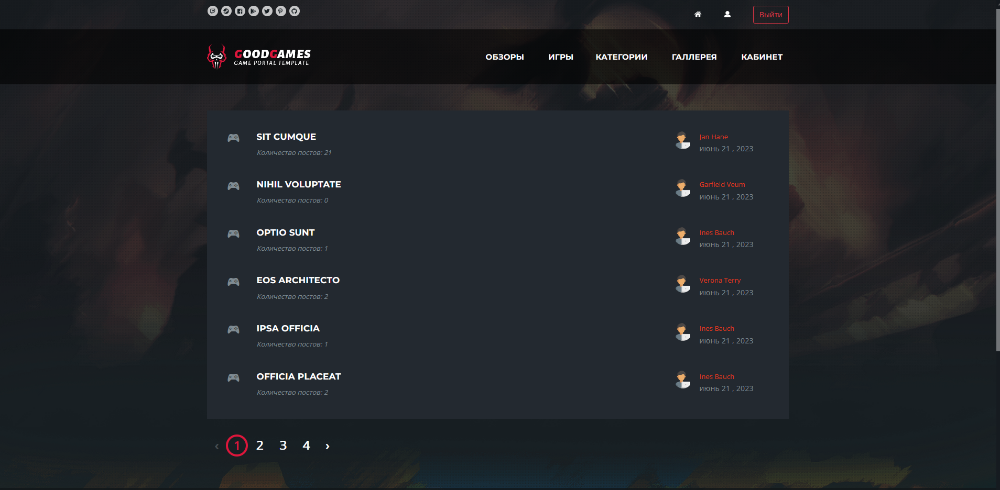
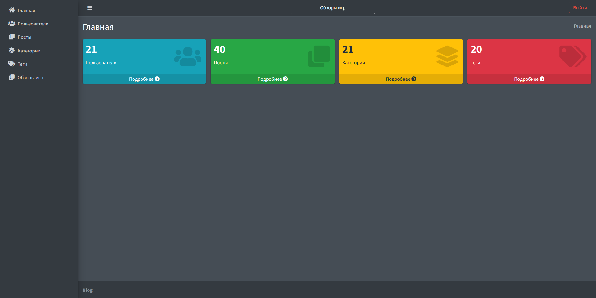

# Laravel Game Reviews

### Installation

Setting up your development environment on your local machine :

- git clone https://github.com/sodaler/game-reviews-laravel.git
- cd game-reviews-laravel
- cp .env.example .env
- composer install
- npm install
- php artisan serve
- npm run dev

---

### Before starting
You need to:  

Run the migrations with seeds:

- php artisan migrate --seed

Generate storage link:

- php artisan storage:link

Starting job for registration:

- php artisan queue:listen

---

### Some Screenshots

